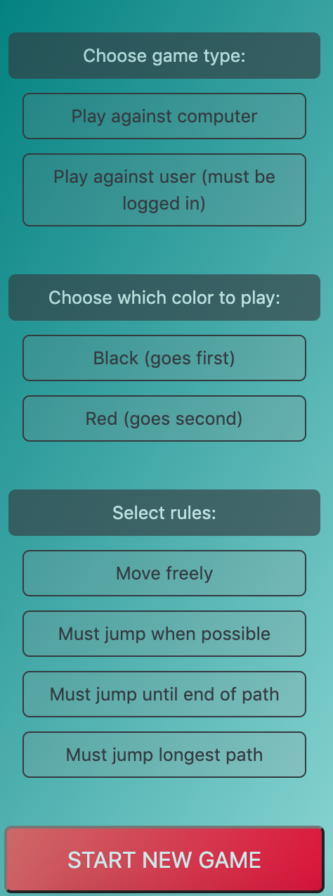

[Gameplay Demo](CheckersDemoCropped.gif)

##Live Demo

Live version deployed on heroku available [here](https://infinite-earth-22785.herokuapp.com/) (initial load may take a moment)

Also check out a quick video demo [here](https://www.youtube.com/watch?v=e4yvt64qAjE&feature=youtu.be)

##Overview

This web application allows users to play the classic board game Checkers, either in real time against another user or else against the computer.  No log in is required for the latter.  

This project is built in React and combines HTML drag-and-drop functionality and AJAX calls with complicated game logic in order to allow gameplay in four different rules variants, selected by the user.  The backend, built in **Node/Express**, connects to a **MongoDB** database using **Mongoose** and stored on Cloud Atlas servers and contains a simple algorithm to compute the best next move by examining all possible scenarios six turns forward.  Authentication is handled in accordance with best practices using **Passport JS** and **Express Session** and the user display is updated automatically through server sent events.  **React Bootstrap** is used for most of the frontend buttons, menus and forms.

##User instructions

No log in is required to play against the computer.  To play against another user, create an account (entering a dummy email address is fine, since you won't be asked to confirm your account).  After signing up or loging in, you should be redirected back to the home page, which will display your status as either signed in as a user or signed in as a guest.  To start a game, simply select the various options on the side panel and then click the *Start New Game* button.  If you're logged in, once you start the game, a url should be displayed on the side panel.  Simply copy this and send to another user in order for them to join the game.

##Where to find the most interesting code in this repository

* For the bulk of the game logic, see [this component](https://github.com/ZalmanKelber/Checkers/blob/master/client/src/components/sections/BoardArea.js)
* For the algorithm that computes the optimal next move, see [this backend function](https://github.com/ZalmanKelber/Checkers/blob/master/utils/generateNewMove.js)
* To see how the backend API sends game data to the user, see [this router](https://github.com/ZalmanKelber/Checkers/blob/master/routers/game.js)

##Known issues and bugs

* captured pieces section changes size when pieces are captured, causing board to shift position on screen
* when two users play against each other, one or both may be required to refresh their page before or after the first move
* full image does not always drag when piece is selected and moved
* drag-and-drop not yet available for mobile version
* Facebook and Google OAuth not yet added
* Computer algorithm works well in early and mid game but has trouble with late game play

##Note about art

The design of this game was inspired both by the **Red and Black trees** known to students of Data Structures and Algorithms as well as the **Black Figure and Red Figure Vases** of Classical and Preclassical Ancient Greece.
